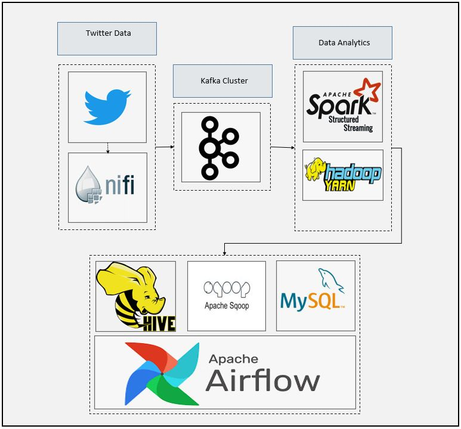
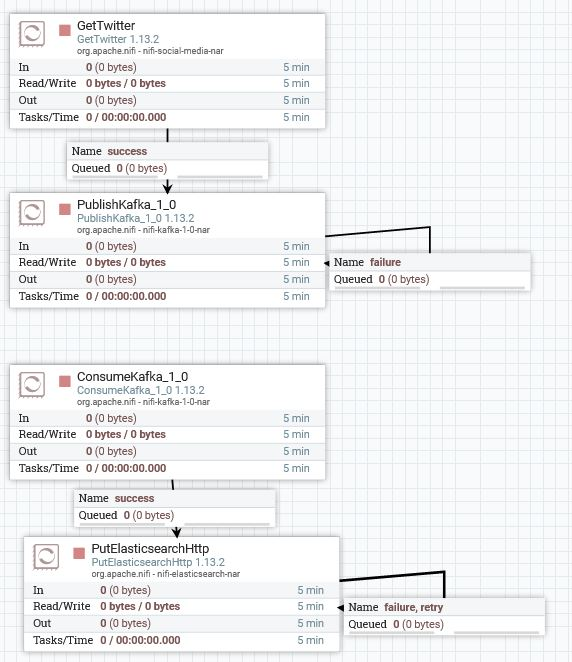
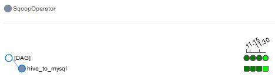
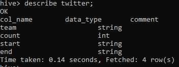
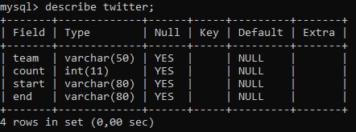
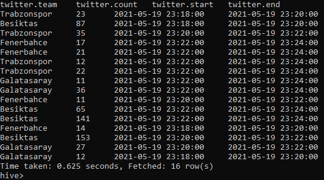
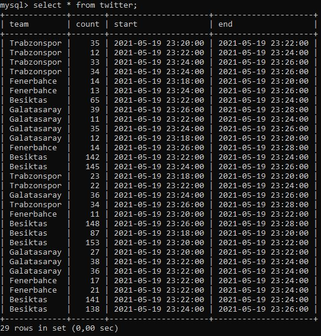

# SparkStream Spark to Hive and Schedule Airflow for Storage
### Dataflow Pipeline


### Summary

In this application turkish super league football teams tweets collected by nifi as a source data. Source data published continuously to kafka topic. Kafka topic consumed using Pyspark api and several dataframe structured to store them into hive. Apache airflow used to schedule task to transfer data from hive to mysql in 10 minutes interval. This is good example to create connection between Spark and Hive as well as using Apache Airflow to schedule repeated task.

### Task List

- [x] Create nifi pipeline



- [x] Create kafka topic

- [x] Define spark session
```
#Create Spark Session to Connect Spark Cluster
spark = SparkSession \
        .builder \
        .master("local[*]") \
        .appName("Spark_Hive") \
        .config("spark.streaming.stopGracefullyOnShutdown", "true") \
        .enableHiveSupport() \
        .getOrCreate()
```
- [x] Define schema for twitter data
```
schema = StructType([
    StructField("timestamp_ms", StringType()),
    StructField("text", StringType()),
    StructField("user", StructType([
        StructField("id", LongType()),
        StructField("followers_count", IntegerType()),
        StructField("friends_count", IntegerType()),
        StructField("statuses_count", IntegerType())]))
])
```
- [x] Read data from kafka
```
kafka_df = spark.readStream \
    .format("kafka") \
    .option("kafka.bootstrap.servers", KAFKA_BOOTSTRAP_SERVERS_CONS) \
    .option("subscribe", KAFKA_TOPIC_NAME_CONS) \
    .option("startingOffsets", "latest") \
    .option("failOnDataLoss", "false") \
    .load()
```
- [x] Deserialize and explode data
```
value_df = kafka_df.select(from_json(col("value").cast("string"), schema).alias("value"))

explode_df = value_df.selectExpr("value.timestamp_ms",
                                 "value.text",
                                 "value.user.id",
                                 "value.user.followers_count",
                                 "value.user.friends_count",
                                 "value.user.statuses_count")
```
- [x] Create user defined function to count tweets of football teams
```
def getTeamTag(text):
    if "Fenerbahce" in text or "Fenerbahçe" in text:
        result = "Fenerbahce"
    elif "Galatasaray" in text:
        result = "Galatasaray"
    elif "Besiktas" in text or "Beşiktaş" in text:
        result = "Besiktas"
    else:
        result = "Trabzonspor"
    return result

udfgetTeamTag = udf(lambda tag: getTeamTag(tag), StringType())
```

- [x] Create new column using UDF
```
explode_df = explode_df.withColumn("timestamp_ms", col("timestamp_ms").cast(LongType()))

df = explode_df.select(
    from_unixtime(col("timestamp_ms")/1000,"yyyy-MM-dd HH:mm:ss").alias("timestamp"),
    col("text"),
    col("id"),
    col("followers_count"),
    col("friends_count").alias("followed_count"),
    col("statuses_count").alias("tweet_count"),
    udfgetTeamTag(col("text")).alias("team")
)

```
- [x] Start 2 minutes window
```
# Create 2 minutes thumbling window
window_count_df = df \
    .withWatermark("timestamp", "10 seconds") \
    .groupBy(col("team"),
        window(col("timestamp"),"2 minutes")) \
        .agg(count("team").alias("count"))

window_count_df2 = window_count_df.withColumn("start", expr("window.start"))
window_count_df3 = window_count_df2.withColumn("end", expr("window.end")).drop("window")

```
- [x] Create hive table
```
spark.sql("""CREATE TABLE IF NOT EXISTS twitter
            (team string, count integer, start timestamp, end timestamp)
            ROW FORMAT DELIMITED
            FIELDS TERMINATED BY '\t'
            LINES TERMINATED BY '\n'
            STORED AS TEXTFILE
                                                """);

```
- [x] Define foreachBatch function to write stream data into hive
```
# Hive save foreachBatch udf function
def save_to_hive_table(current_df, epoc_id):
    print("Inside save_to_hive_table function")
    print("Printing epoc_id: ")
    print(epoc_id)
    current_df.write \
        .format("csv") \
        .insertInto("twitter")
    print("Exit out of save_to_hive_table function")

```
- [x] Write data into hive table
```
# Save data to hive
console_query = window_count_df3 \
    .writeStream \
    .trigger(processingTime='2 minutes') \
    .outputMode("update") \
    .foreachBatch(save_to_hive_table) \
    .option("checkpointLocation", "Hive/chk-point-dir") \
    .start()

console_query.awaitTermination()
```
- [x] Create dag.py file

- [x] Write data into hive table
```
#Define default arguments for dag process
default_args = {
    "owner": "airflow",
    "email_on_failure": True,
    "email_on_retry": True,
    "email": "admin@localhost.com",
    "retry": 1,
    "retry_delay": timedelta(minutes=5)
}
```
- [x] Create dag to schedule 10 minutes data transfer from hive to mysql
```
with DAG("twitter",start_date=datetime(2021, 1, 1),
         schedule_interval="*/10 * * * *", default_args=default_args, catchup=False) as dag:

         #Sqoop Operator
         hive_to_mysql = SqoopOperator(
            task_id = "hive_to_mysql",
            conn_id = "sqoop_conn",
            cmd_type = "export",
            table = "twitter",
            hcatalog_table = "twitter"
         )
```



Here is hive table



Here is mysql table



### Code Description

spark_kafka_nifi_twitter_follower_counter.py is spark streaming code for data ingestion, storage, processing

### Running

1. Start zookeeper (Check kafka scripts)

```
zookeeper-server-start.bat config\zookeeper.properties (zookeeper-server-start.sh for linux)
```

2. Start kafka (Check kafka scripts)
```
kafka-server-start.bat config\server.properties  (kafka-server-start.sh for linux)
```

3. Start nifi and processors

4. Execute below code

```
spark-submit --packages org.apache.spark:spark-sql-kafka-0-10_2.12:3.0.1 spark_hive.py

```
5. Put dag.py file into dag folder in airflow directory

6. Go to airflow url

7. Start dag

8. Check results




